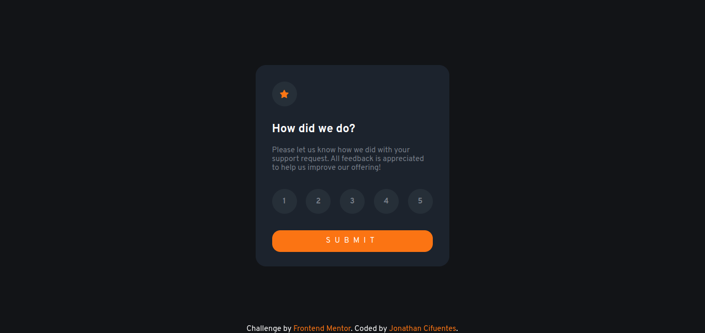

# Frontend Mentor - Interactive rating component solution

This is a solution to the [Interactive rating component challenge on Frontend Mentor](https://www.frontendmentor.io/challenges/interactive-rating-component-koxpeBUmI). Frontend Mentor challenges help you improve your coding skills by building realistic projects.

## Table of contents

- [Overview](#overview)
  - [The challenge](#the-challenge)
  - [Screenshot](#screenshot)
  - [Links](#links)
- [My process](#my-process)
  - [Built with](#built-with)
  - [What I learned](#what-i-learned)
  - [Continued development](#continued-development)
  - [Useful resources](#useful-resources)
- [Author](#author)

## Overview

### The challenge

Users should be able to:

- View the optimal layout for the app depending on their device's screen size
- See hover states for all interactive elements on the page
- Select and submit a number rating
- See the "Thank you" card state after submitting a rating

### Screenshot



### Links

- Solution URL: [Add solution URL here](https://www.frontendmentor.io/solutions/interactive-rating-component-using-html-css-and-js-IHhsoTbviU)
- Live Site URL: [Add live site URL here](https://hexordzx.github.io/Interactive-Rating-Component/)

## My process

### Built with

- Semantic HTML5 markup
- CSS custom properties
- Flexbox
- Mobile-first workflow
- Vanilla JS

### What I learned

With HTML i learned how to use the tags properly.

```html
<section class="rating-state">
  <figure class="icon">
    
  </figure>

  <h2>How did we do?</h2>
  <p>
    Please let us know how we did with your support request. All feedback is
    appreciated to help us improve our offering!
  </p>

  <ul class="rate">
    <li class="btn" value="1">1</li>
    <li class="btn" value="2">2</li>
    <li class="btn" value="3">3</li>
    <li class="btn" value="4">4</li>
    <li class="btn" value="5">5</li>
  </ul>
  <button class="button">SUBMIT</button>
</section>
```

Using CSS i learned how to use properties on classes.

```css
.rating-state {
  background-color: #1c232d;
  border-radius: 1.25rem;
  padding: 2rem;
  position: relative;
  max-width: 375px;
  height: 60%;
  margin: 1rem;
}
```

Finally with js, i learned how to make a function to manipulate elements on the DOM

```js
function handleRatingBtn(event) {
  ratingBtns.forEach((btn) => {
    btn.classList.remove("selected");
  });

  if (event.target.classList.contains("btn")) {
    event.target.classList.add("selected");
  } else {
    event.target.parentElement.classList.add("selected");
  }

  stars_score = event.target.value;
}
```

### Continued development

I have to continue studying JavaScript because i still have issues on how to manipulate DOM, also i feel more confortable using CSS without any framework but i think i'll improve my timing if i using it.

### Useful resources

- [CSS-Tricks](https://css-tricks.com/) - This helped me to get an idea of how to make my styles on the webpage
- [cssreference.io](https://cssreference.io/) - This is an amazing dictionary for those who get lost on the css utilities.

## Author

- Frontend Mentor - [@HexordZX](https://www.frontendmentor.io/profile/HexordZX)
- Twitter - [@Jonatha90564714](https://twitter.com/Jonatha90564714)
